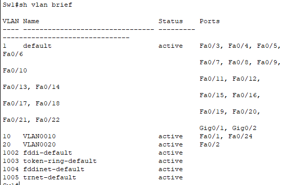

# 计算机网络实验报告

第六组人员名单
| | |
| --- | --- |
| 161250132 | 涂斌砚 |
| 161250139 | 王宁（组长） |
| 161250140 | 王宁一 |
| 161250141 | 王颀涵 |
| 161250142 | 王秋 |

## 一、使用技术
- RIPv2动态路由
- Vlan路由连接
- 交换机子网划分，交换机之间Trunk构建
- ACL防火墙设置
- NAT网络地址转换

## 二、实验目标
- 掌握不同设备之间的连接方式
- 掌握在路由器上配置RIPv2动态路由
- 掌握查看和调试RIPv2过程信息
- 了解交换机Vlan的布局和配置
- 熟悉trunk的配置和使用
- 熟悉Vlan之间信息传递过程
- 掌握静态NAT的配置和使用
- 掌握动态NAT的配置和使用
- 掌握路由器和交换机的命令使用
- 掌握ACL的配置

## 三、实验内容
- 按照拓扑进行连接
- 配置各个设备的接口以及ip地址等信息
- 配置交换机Vlan以及trunk
- 配置RIPv2
- 配置NAT
- 配置ACL

## 四、实验拓扑


## 五、实验步骤

### 1、配置交换机
#### (i.) Trunk
配置Sw1
```
switch>enable
switch#conf t
switch(config)#hostname Sw1
Sw1(config)#int g 1/0/23
Sw1(config)#switchport mode trunk
```

配置Sw2
```
switch>enable
switch#conf t
switch(config)#hostname Sw2
Sw2(config)#int g 1/0/23
Sw2(config)#switchport mode trunk
```

#### (ii.) 划分Vlan

配置Sw1
```
Sw1(config)#vlan 10
Sw1(config-vlan)#vlan 20
```

配置Sw2
```
Sw2(config)#vlan 10
Sw2(config-vlan)#vlan 20
```

#### (iii.) Vlan
配置Sw1
```
Sw1(config)#int g1/0/1
Sw1(config-if)#switchport mode access
Sw1(config-if)#switchport access vlan 10
Sw1(config-if)#int g1/0/2
Sw1(config-if)#switchport mode access
Sw1(config-if)#switchport access vlan 20
Sw1(config-if)#int g1/0/24
Sw1(config-if)#switchport mode access
Sw1(config-if)#switchport access vlan 10
```

配置Sw2
```
Sw2(config)#int g1/0/1
Sw2(config-if)#switchport mode access
Sw2(config-if)#switchport access vlan 10
Sw2(config-if)#int g1/0/2
Sw2(config-if)#switchport mode access
Sw2(config-if)#switchport access vlan 20
Sw2(config-if)#int g1/0/24
Sw2(config-if)#switchport mode access
Sw2(config-if)#switchport access vlan 20
```

### 2、配置路由器
#### (i.) 接口或者逻辑接口ip
配置Router1
```
Router>en
Router#conf t
Router(config)#hostname Router1
Router1(config)#int g0/0/0
Router1(config-if)#ip address 192.168.10.1 255.255.255.0
Router1(config-if)#no shutdown
Router1(config-if)#int s0/1/0
Router1(config-if)#ip address 192.168.50.1 255.255.255.0
Router1(config-if)#no shutdown
```

配置Router2
```
Router>en
Router#conf t
Router(config)#hostname Router2
Router2(config)#int s0/1/0
Router2(config-if)#ip address 192.168.50.2 255.255.255.0
Router2(config-if)#no shutdown
Router2(config)#int s0/1/1
Router2(config-if)#ip address 192.168.60.1 255.255.255.0
Router2(config-if)#no shutdown
```

配置Router3
```
Router>en
Router#conf t
Router(config)#hostname Router3
Router3(config)#int s0/1/0
Router3(config-if)#ip address 192.168.70.1 255.255.255.0
Router3(config-if)#no shutdown
Router3(config)#int s0/1/1
Router3(config-if)#ip address 192.168.60.2 255.255.255.0
Router3(config-if)#no shutdown
```

配置Router4
```
Router>en
Router#conf t
Router(config)#hostname Router4
Router4(config)#int g0/0/0
Router4(config-if)#ip address 192.168.20.1 255.255.255.0
Router4(config-if)#no shutdown
Router4(config-if)#int s0/1/0
Router4(config-if)#ip address 192.168.70.2 255.255.255.0
Router4(config-if)#no shutdown
```

#### (ii.) RIPv2
配置Router1
```
Router1(config)#router rip
Router1(config-router)#network 192.168.10.0
Router1(config-router)#network 192.168.20.0
Router1(config-router)#network 192.168.50.0 
```

配置Router2
```
Router2(config)#router rip
Router2(config-router)#network 192.168.50.0
Router2(config-router)#network 192.168.60.0
```

配置Router3
```
Router3(config)#router rip
Router3(config-router)#network 192.168.60.0
Router3(config-router)#network 192.168.70.0
```

配置Router4
```
Router4(config)#router rip
Router4(config-router)#network 192.168.10.0
Router4(config-router)#network 192.168.20.0
Router4(config-router)#network 192.168.70.0
```  

### 3、配置PC
手动配置PC1
```
ip address 192.168.10.2 255.255.255.0
default gateway 192.168.10.1
```

手动配置PC2
```
ip address 192.168.20.2 255.255.255.0
default gateway 192.168.20.1
```

手动配置PC3
```
ip address 192.168.10.3 255.255.255.0
default gateway 192.168.10.1
```

手动配置PC4
```
ip address 192.168.20.3 255.255.255.0
default gateway 192.168.20.1
```

### 4、vlan以及trunk测试
以PC1作为测试机器，其他机器类似
```
C:/>ping 192.168.20.2
C:/>ping 192.168.10.3
C:/>ping 192.168.20.3
```


查看vlan
```
Sw1
Sw1#sh vlan brief
```


```
Sw2
Sw2#sh vlan brief
```


### 5、动态路由测试
以PC1作为测试机器，其他机器类似
```
C:/>ping 192.168.50.1
C:/>ping 192.168.60.1
C:/>ping 192.168.70.1
```

查看Router1的路由表
```
Router1#sh ip route
```


查看Router2的路由表
```
Router2#sh ip route
```


查看Router3的路由表
```
Router3#sh ip route
```


查看Router4的路由表
```
Router4#sh ip route
```


### 6、配置ACL以及测试
#### (i.) 测试封杀ping命令
配置Router2
```
Router2(config)#access-list 100 deny icmp 192.168.60.1 0.0.0.0 192.168.60.2 0.0.0.0
Router2(config)#access-list 100 permit ip any any
Router2(config)#int s0/1/1
Router2(config-if)#ip access-group 100 out
```

配置Router3
```
Router3(config)#access-list 100 deny icmp host 192.168.60.1 host 192.168.60.2
Router3(config)#access-list 100 permit icmp any any
Router3(config)#int s0/1/1
Router3(config-if)#ip access-group 100 in
```

在Router2中进行检测
```
Router2(config)#exit
Router2#ping 192.168.60.2
```


#### (ii.) 测试禁止telnet命令
配置Router2
```
还原Router2的配置
Router2(config)#int s0/1/1
Router2(config-if)#no ip access-group 100 out
```

配置Router3
```
还原Router3的配置
Router3(config)#int s0/1/1
Router3(config-if)#no ip access-group 100 in

开始配置telnet
Router3(config)#enable secret cisco
Router3(config)#line vty 0 4
Router3(config-line)#password cisco
Router3(config-line)#login

开始创建ACL
Router3(config)#access-list 101 deny tcp host 192.168.60.1 any eq 23
Router3(config)#access-list 101 permit ip any any
Router3(config)#int s0/1/1
Router3(config-if)#ip access-group 101 in
```

在Router2测试
```
Router2#ping 192.168.60.2
Router2#telnet 192.168.60.2
```


### 7、配置NAT以及测试
配置Router2静态NAT
```
Router2(config)#ip nat inside source static 192.168.50.1 192.168.60.254
Router2(config)#int s0/1/0
Router2(config-if)#ip nat inside
Router2(config)#int s0/1/1
Router2(config-if)#ip nat outside
Router2(config)#end
```

在Router2上看NAT转换表
```
Router2#sh ip nat translations
```


## 六、功能总结
本次实验使得两个包含交换机的网络（其中每个含有两个`vlan`区域）可以通过相互通信。同一`Vlan`使用`Trunk`进行通信，`vlan`间使用路由器进行转发，而路由器之间使用`RIPv2`进行动态路由，在中间的两个路由器间使用了`ACL`进行防火墙设置，使得路由器Router3不能使用`Telnet`登录Router3。同时使用NAT技术，使得来自192.168.50.1的局部地址的请求通过NAT转换访问到192.168.60.2。