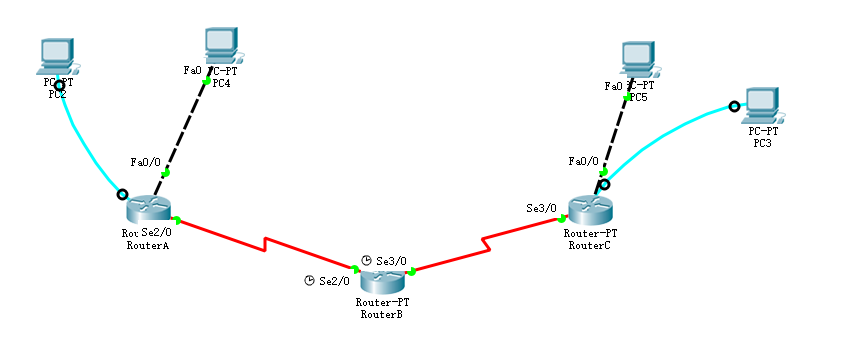

# 第八章--静态路由

对一个拓扑如下图所示的路由器进行静态路由配置：



## 连接说明

注意蓝色线为`console线`，红色为`Serial DTE`或者`Serial DCE`线，黑色为`双绞线`，不同设备之间的连接有约定，不可随便连接。

- `console线`连接的是路由器`console`端口和PC的`RS 232`端口
- `Serial DTE/DCE`连接的是两个路由器的`Serial`串口
- `双绞线`连接PC和路由器的`Ethernet`或其它类似的端口

补充：在DCE端口设置`clock rate xxx`，其它与DTE无区别。

## **步骤**：

### 首先配置各个端口的IP地址

比如，实际可能不是这些端口：

```bash
PC4 -> FastEthernet0:192.168.10.2

RouterA -> FastEthernet0/0:192.168.10.1
RouterA -> Serial2/0:192.168.20.1

RouterA -> Serial2/0:192.168.20.2
RouterA -> Serial3/0:192.168.30.2

RouterC -> FastEthernet0/0:192.168.40.1
RouterC -> Serial2/0:192.168.30.2

PC5 -> FastEthernet0:192.168.40.2
```

### **配置路由表**

> 个人体会：所谓路由配置就是告诉路由器当一个请求来的时候，如何把发向目标IP的请求给转发到正确的端口去（路由器有很多端口）。静态路由配置就是为路由器指明这样的路由规则表。

下面以配置RouterA为例，进行说明

```bash
#到40.0/24网段的请求都转发到30.2去，即RouterB的与30.2相连接的端口
RouterA# ip route 192.168.40.0 255.255.255.0 192.168.30.2

#而要找到30.2这个IP，就需要访问30.0/24这个网段，因此需要告诉路由器可以通过RouterB的20.2
RouterA# ip route 192.168.30.0 255.255.255.0 192.168.20.2

#RouterB的20.2与RouterA直接相连，因此不需要再进行路由配置
```

同理配置RouterC

现在配置RouterB，即中间那个路由器

```bash
RouterB# ip route 192.168.40.0 255.255.255.0 192.168.30.1
RouterB# ip route 192.168.30.0 255.255.255.0 192.168.20.1
```

至此，路由配置大功告成，你可以通过RouterA ping通 RouterC或者相反。但是如果你通过PC4或者PC5却不能ping通对方，这是因为你没有配置网关。

### 网关配置

因为PC本身没有路由器那样路由转发的功能，当需要发起网络请求时，PC无法知道将请求发向何方，网关就提供这样一个功能，`告诉PC将请求发到这个地方进行转发`。

因此你需要在PC4或者PC5上配置默认网关：

```bash
配置路径：IP Configuration -> DefaultGateWay -> 192.168.10.1或者192.168.40.1
```